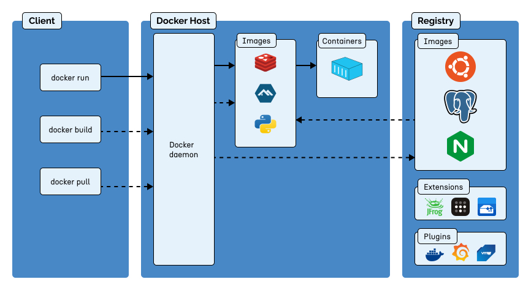

# Introducción
# ¿Qué es Docker?
**[Docker](https://www.docker.com/)** es una plataforma abierta para desarrollar, enviar y ejecutar aplicaciones. Que permite **separar las aplicaciones de su infraestructura**, y que facilita la **entrega rápida de software**. Con Docker, es posible administrar su infraestructura de la misma manera que se administran las aplicaciones. Al aprovechar las **metodologías de Docker** para enviar, probar e implementar código rápidamente, se puede **reducir significativamente el tiempo** entre escribir código y ejecutarlo en producción.

## Plataforma Docker
Docker proporciona la capacidad de **empaquetar y ejecutar una aplicación** en un entorno de **aislamiento flexible** llamado contenedor. El **aislamiento** y la **seguridad** permiten ejecutar múltiples contenedores simultáneamente en un host determinado. Los contenedores son **livianos** y contienen todo lo necesario para ejecutar la aplicación, por lo que no necesita depender de lo que está instalado actualmente en el host. Puedes compartir fácilmente los contenedores mientras trabaja y asegurarse que todas las personas con las que comparte obtengan el **mismo contenedor** que funciona de la misma manera.

- Docker proporciona herramientas y una plataforma para administrar el ciclo de vida de sus contenedores:
  - **Desarrolla** tu aplicación y sus componentes de soporte utilizando contenedores.
  - **El contenedor** se convierte en la unidad para distribuir y probar tu aplicación.
  - **Cuando estés listo**, despliega tu aplicación en tu entorno de producción, ya sea como un contenedor o como un servicio orquestado.

## ¿Para qué puedo usar Docker?
### Entrega rápida y consistente tus aplicaciones

Docker **optimiza** el ciclo de vida de desarrollo al permitir a los desarrolladores trabajar en **entornos estandarizados** utilizando **contenedores locales** que proporcionan tus aplicaciones y servicios. Los **contenedores** son ideales para flujos de trabajo de **integración continua** y **entrega continua** (CI/CD).

### Despliegue receptivo y escalado
La plataforma basada en contenedores de Docker que permite cargas de trabajo altamente portátiles. Los contenedores de Docker pueden ejecutarse en la **cumputadora local de un desarrollador**, en máquinas físicas o virtuales en un centro de datos, en proveedores de nube o en una combinación de entornos.

La **portabilidad** y la **ligereza** de Docker también facilitan la administraciín dinámica de cargas de trabajo, escalando aplicaciones y servicios según las necesidades del negocio, en tiempo casi real.

### Ejecutando más cargas de trabajo en el mismo hardware
Docker es **ligero** y **rápido**. Proporciona una alternativa **viable** y **rentable** a las máquinas virtuales basadas en hipervisor, para que puedas utilizar más capacidad de tu servidor y alcanzar tus objetivos empresariales. Docker es perfecto para entornos de alta densidad y despliegues **pequeños** y **medianos**, donde necesitas hacer más **con menos recursos**.

## Arquitectura de Docker
Docker utiliza una arquitectura `cliente-servidor`. El _cliente_ de Docker se comunica con el _demonio_ de Docker, que se encarga de realizar las tareas pesadas de construir, ejecutar y distribuir los contenedores de Docker. El _cliente_ y el _demonio_ de Docker pueden **ejecutarse** en el mismo sistema o puedes conectar un _cliente_ de Docker a un _demonio_ de Docker remoto. El _cliente_ y el _demonio_ de Docker se comunican mediante una API REST, a través de sockets UNIX o una interfaz de red. Otro _cliente_ de Docker es **Docker Compose**, que te permite trabajar con aplicaciones que constan de un conjunto de contenedores.


### El demonio de Docker
El demonio de Docker (`dockerd`) escucha las solicitudes de la API de Docker y administra los objetos de Docker, como imágenes, contenedores, redes y volúmenes. Un demonio también puede comunicarse con otros demonios para administrar los servicios de Docker.

### El cliente de Docker
El cliente de Docker (`docker`) es la forma principal en que muchos usuarios de Docker interactúan con Docker. Cuando utilizas comandos como `docker run`, el cliente envía estos comandos al demonio de Docker(`dockerd`), que los ejecuta.  El comando `docker` utiliza la API de Docker. El cliente de Docker puede comunicarse con más de un demonio.

### Docker Desktop
[Docker Desktop](https://docs.docker.com/desktop/) es una aplicación fácil de instalar para MacOS, Windows o Linux que te permite construir y compartir aplicaciones y microservicios en contenedores. Docker Desktop incluye el demonio de Docker (`dockerd`), el cliente de Docker (`docker`), Docker Compose, Docker Content Trust, Kubernetes y Credential Helper.

### Registros de Docker
Un _registro_ de Docker almacena imágenes de Docker. [Docker Hub](https://hub.docker.com/) es un registro público que cualquiera puede utilizar, y Docker está configurado para buscar imágenes en [Docker Hub](https://hub.docker.com/) de forma predeterminada. Incluso puedes ejecutar tu propio registro privado.

Cuando utilizas los comandos `docker pull` o `docker run`, las imágenes requeridas se descargan desde tu registro configurado. Cuando utilizas el comando `docker push`, tu imagen se envía a tu registro configurado.

### Objetos de Docker
Cuando utilizas Docker, estás creando y utilizando imágenes, redes, volúmenes, complementos y otros objetos.

#### Imágenes
Una _imagen_ es un plantilla de solo lectura con instrucciones para crear un contenedor de Docker. A menudo, una imagen se basa en otra imagen, con algunas personalizaciones adicionales. Por ejemplo, puedes construir una imagen basada en la imagen de `Ubuntu`, pero instalar el servidor web Apache y tu aplicación, así como los detalles de configuración necesarios para hacer funcionar tu aplicación.

Puedes crear tus propias imágenes o simplemente utilizar las creadas por otros y publicadas en un registro. Para construir tu propia imagen, creas un _Dockerfile_ con una sintaxis sencilla que define los pasos necesarios para crear y ejecutar la imagen. Cada instrucción en un _Dockerfile_ crea una capa en la imagen. Cuando modificas el _Dockerfile_ y reconstruyes la imagen, solo se reconstruyen las capas que han cambiado. Esto es parte de lo que hace que las imágenes sean tan ligeras, pequeñas y rápidas en comparación con otras tecnologías de virtualización.

#### Contenedores

Un contenedor es una instancia ejecutable de una imagen. Puedes crear, iniciar, detener, mover o eliminar un contenedor utilizando la API o la interfaz de línea de comandos de Docker. Puedes conectar un contenedor a una o más redes, adjuntar almacenamiento a él o incluso crear una nueva imagen basada en su estado actual.

Por defecto, un contenedor está relativamente aislado de otros contenedores y de su máquina host. Puedes controlar el grado de aislamiento de la red, almacenamiento u otros subsistemas subyacentes de un contenedor con respecto a otros contenedores o a la máquina host.

Un contenedor se define por su imagen, así como por cualquier opción de configuración que le proporciones al crearlo o iniciarlo. Cuando se elimina un contenedor, todos los cambios en su estado que no están almacenados en almacenamiento persistente desaparecen.

## La tecnología subyacente
Docker está escrito en el [lenguaje de programación Go](https://go.dev/) y aprovecha varias características del kernel de Linux para ofrecer su funcionalidad. Docker utiliza una tecnología llamada `namespaces` para proporcionar el espacio de trabajo aislado conocido como contenedor. Cuando ejecutas un contenedor, Docker crea un conjunto de _namespaces_ para ese contenedor.

Estos namespaces proporcionan una capa de aislamiento. Cada aspecto de un contenedor se ejecuta en un namespace separado y su acceso está limitado a ese namespace.

## La línea de comandos de Docker (CLI):
### docker:
Para listar los comandos disponibles, ejecuta `docker` sin parámetros o ejecuta `docker help`.

#### Subcomandos:
| Nombre | Descripción |
| :-- | :-- |
| `attach` | Adjuntar flujos de error, salida y entrada estándar local a un contenedor en ejecución |
| `build` | Compilar una imagen a partir de un Dockerfile |
| `builder` | Administra compilaciones |
| `checkpoint` | Administra puntos de control |
| `commit` | Crear una nueva imagen a partir de los cambios de un contenedor. |
| `config` | Administra configuraciones de Swarm |
| `container` | Administrar contenedores |
| `context` | Administrar contextos |
| `cp` | Copiar archivos/carpetas entre un contenedor y el sistema de archivos local |
| `create` | Crear un nuevo contenedor |
| `diff` | Inspeccionar los cambios en archivos o directorios en el sistema de archivos de un contenedor |
| `events` | Obtener eventos en tiempo real del servidor |
| `exec` | Ejecutar un comando en un contenedor en ejecución |
| `export` | Exportar el sistema de archivos de un contenedor como un archivo tar |
| `history` | Mostrar el historial de una imagen |
| `image` | Administrar imágenes |
| `images` | Listar imágenes |
| `import` | Importar el contenido de un archivo tar para crear una imagen de sistema de archivos |
| `info` | Mostrar información de todo el sistema |
| `inspect` | Devolver información de bajo nivel sobre los objetos de Docker |
| `kill` | Finalizar uno o más contenedores en ejecución |
| `load` | Cargar una imagen desde un archivo tar o STDIN |
| `login` | Iniciar sesión en un registro |
| `logout` | Cerrar sesión desde un registro |
| `logs` | Obtener los registros (logs) de un contenedor |
| `manifest` | Administrar manifiestos y listas de manifiestos de imágenes de Docker |
| `network` | Administrar redes |
| `node` | Administrar nodos de Swarm |
| `pause` | Pausar todos los procesos dentro de uno o más contenedores |
| `plugin` | Aministrar plugins |
| `port` | Listar mapeos de puertos o un mapeo específico para el contenedor |
| `ps` | Listar contenedores |
| `pull` | Descargar una imagen desde un registro |
| `push` | Subir una imagen a un registro |
| `rename` | Cambiar el nombre de un contenedor |
| `restart` | Reiniciar uno o más contenedores |
| `rm` | Eliminar uno o más contenedores |
| `rmi` | Eliminar uno o má imágenes |
| `run` | Crear y ejecutar un nuevo contenedor a partir de una imagen |
| `save` | Guardar una o más imágenes en un archivo tar (transmitido a STDOUT de forma predeterminada) |
| `search` | Buscar imágenes en Docker Hub |
| `secret` | Administrar secretos de Swarm |
| `service` | Administrar servicios de Swarm |
| `stack` | Administrar pilas de Swarm |
| `start` | Iniciar uno o más contenedores detenidos |
| `stats` | Mostrar una transmisión en vivo de las estadísticas de uso de recursos del o los contenedores |
| `stop` | Detener uno o más contenedores en ejecución |
| `swarm` | Administrar Swarm |
| `system` | Administrar Docker |
| `tag` | Crear una etiqueta (tag) TARGET_IMAGE que se refiere a SOURCE_IMAGE |
| `top` | Mostrar los procesos en ejecución de un contenedor |
| `trust` | Administrar la confianza en las imágenes de Docker |
| `unpause` | Reanudar todos los procesos dentro de uno o más contenedores |
| `update` | Actualizar la configuración de uno o más contenedores |
| `version` | Mostrar la información de la versión de Docker |
| `volume` |  Administrar volúmenes |
| `wait` | Bloquear hasta que uno o más contenedores se detengan, luego imprimir sus códigos de salida |

#### Opciones:
| Nombre | Tipo | Predeterminado | Descripción |
| :-- | :-- | :-- | :-- |
| `--config` | `string` | `/root/.docker` | Ubicación de los archivos de configuración del cliente |
| `-c`, `--context` | `string` |  | Nombre del contexto a utilizar para conectarse al demonio (anula la variable de entorno DOCKER_HOST y el contexto predeterminado establecido con `docker context use`) |
| `D`, `--debug` | | | Activar el modo de depuración |
| `-H`, `--host` | `list` | | Socket del demonio al que conectar |
| `-l`, `--log-level` | `string` | `info` | Establecer el nivel de registro (`debug` \| `info` \| `warn` \| `error` \| `fatal`) |
| `--tls` | | | Usar TLS; implícito con --tlsverify |
| `--tlscacert` | `string` | `/root/.docker/ca.pem` | Confiar solo en certificados firmados por esta autoridad de certificación (CA) |
| `--tlscert` | `string` | `/root/.docker/cert.pem` | Ruta al archivo de certificado TLS |
| `--tlskey` | `string` | `/root/.docker/key.pem` | Ruta al archivo de clave TLS |
| `--tlsverify` | | | Usar TLS y verificar el remoto |

### Ejemplos:

- `docker pull` - Descarga una imagen o un repositorio desde un registro.
  <details>
  <summary><strong>Ejemplo:</strong></summary>

  ```powershell
  $ docker pull hello-world
  Using default tag: latest
  latest: Pulling from library/hello-world
  719385e32844: Already exists
  Digest: sha256:fc6cf906cbfa013e80938cdf0bb199fbdbb86d6e3e013783e5a766f50f5dbce0
  Status: Downloaded newer image for hello-world:latest
  docker.io/library/hello-world:latest
  ```
  </details>

- `docker run` - Ejecuta un comando en un nuevo contenedor.
  <details>
  <summary><strong>Ejemplo:</strong></summary></br>

  ```powershell
  $ docker run hello-world

  Hello from Docker!
  This message shows that your installation appears to be working correctly.

  To generate this message, Docker took the following steps:
   1. The Docker client contacted the Docker daemon.
   2. The Docker daemon pulled the "hello-world" image from the Docker Hub.
   (amd64)
   3. The Docker daemon created a new container from that image which runs the
   executable that produces the output you are currently reading.
   4. The Docker daemon streamed that output to the Docker client, which sent it 
   to your terminal.

  To try something more ambitious, you can run an Ubuntu container with:
   $ docker run -it ubuntu bash

  Share images, automate workflows, and more with a free Docker ID:
   https://hub.docker.com/

  For more examples and ideas, visit:
   https://docs.docker.com/get-started/
  ```
  </details>

- `docker images` - Lista las imágenes.
  <details>
  <summary><strong>Ejemplo:</strong></summary></br>

  ```powershell
  $ docker images
  REPOSITORY    TAG       IMAGE ID       CREATED       SIZE
  hello-world   latest    9c7a54a9a43c   2 weeks ago   13.3kB
  ```
  </details>

- `docker ps` - Lista los contenedores en ejecución.
  ```powershell
  $ docker ps
  ```

- `docker start` - Inicia uno o más contenedores detenidos.
- **docker stop** - Detiene uno o más contenedores en ejecución.
- **docker build** - Crea una imagen a partir de un Dockerfile.
- **docker push** - Carga una imagen o un repositorio a un registro.
- **docker export** - Exporta un contenedor como un archivo tar.
- **docker exec** - Ejecuta un comando en un contenedor en ejecución.
- **docker search** - Busca una imagen de [Docker Hub](https://hub.docker.com/).
- **docker attach** - Conecta la entrada, la salida y el error estándar.
- **docker commit** - Crea una nueva imagen a partir de los cambios de un contenedor.
- **docker cp** - Copia archivos o carpetas entre un contenedor y el sistema local.
- **docker rm** - Elimina uno o más contenedores.
- **docker rmi** - Elimina una o más imágenes.
- **docker ps** - Lista los contenedores en ejecución.
- **docker images** - Lista las imágenes disponibles localmente.
- **docker info** - Muestra la información del sistema Docker.
- **docker version** - Muestra la versión de Docker.

## Glosario
- **`Docker`:** Una plataforma de código abierto que permite desarrollar, enviar y ejecutar aplicaciones en contenedores.
- **`Contenedor - Container`:** Un entorno aislado y ligero que contiene una aplicación y todas sus dependencias necesarias para ejecutarse de manera independiente.
- **`Imagen - Image`:** Un paquete de solo lectura que incluye todo lo necesario para ejecutar una aplicación, incluyendo el código, las bibliotecas, las herramientas y las configuraciones.

